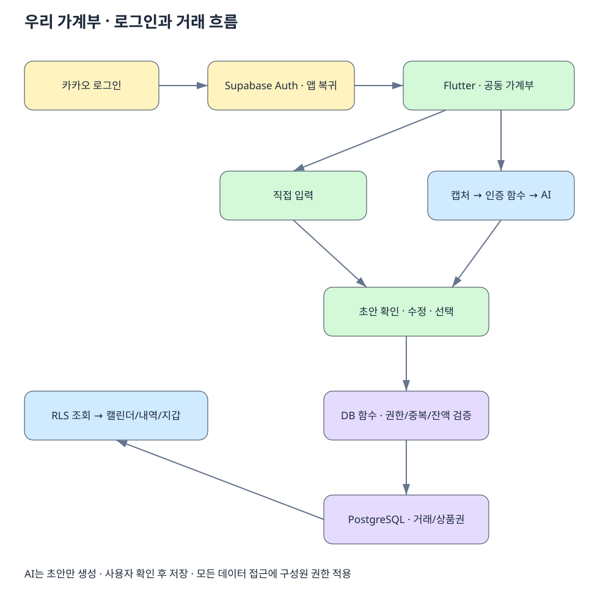

# 상세 설계 초안

2026-09-14 · Inception 후속 설계 · 사용자 검토 완료, 카카오 로그인 반영. 제시한 정책 방향은 수용되었으며 공급자·제한 수치·삭제 보존 기간 등 명시적으로 미정인 항목은 후속 설계에서 확정한다. 코드·DB 배포는 포함하지 않는다.

## 화면 구조

| 화면 | 주요 구성 | 동작과 상태 |
| --- | --- | --- |
| 시작 | 카카오 로그인, 가계부 만들기/초대 참여 | 취소·실패·만료·이미 참여한 상태 안내 |
| 캘린더 | 월 이동, 월 수입/지출, 날짜별 +수입/-지출, 선택 날짜 내역 | 오늘 이동, 빈 날짜, 로딩/실패/재시도. 날짜 선택 후 입력 시 해당 날짜 기본값 |
| 내역 | 일/주/월, 기간 이동, 합계, 날짜별 목록 | 구성원·수단·카테고리 필터. 필터 적용 시 합계도 같은 조건 사용 |
| 거래 상세 | 금액·유형·수단·작성자·최종 수정자 | 수정·삭제, 연결된 환불 조회. 수정 충돌 시 최신값과 재확인 |
| 지갑 | 카드 목록과 목표 대비 실적, 상품권 잔액 | 수단 등록/수정/보관. 카드는 소유자 구분. 실적은 예상값이라고 표시 |
| 설정 | 구성원·초대, 테마, 계정 | 테마 견본/미리보기, 탈퇴는 영향 안내 후 확인 |

거래 등록은 캘린더와 내역의 +에서 직접 입력/캡처 입력을 선택한다. 지갑의 상품권 상세에는 충전/사용 버튼을 둔다. 주요 화면은 하단 탭, 입력과 상세는 별도 화면으로 열고 돌아왔을 때 조회 기간을 유지한다.

### 공통 입력 폼

필수: 거래 유형, 거래 날짜, 원화 정수 금액, 사용처/내용, 카테고리, 결제·입금 수단, 실제 사용자. 메모는 선택. 작성자는 인증 사용자로 서버에서 지정한다.

수입에는 입금 수단, 일반 지출에는 결제 수단, 상품권 충전에는 출금 수단+충전 대상+실제 결제액+충전액을 받는다. 상품권 사용은 지출 합계 제외와 잔액 변화를 저장 전에 보여준다. 신용카드는 추가로 실적 포함 여부를 받는다.

등록한 수단이 없으면 폼에서 등록 후 복귀할 수 있게 한다. 보관된 수단은 새 거래 선택에서 제외하되 과거 기록에는 유지한다. 뒤로 이동 시 작성 중 내용 폐기를 확인한다. 저장 중에는 재입력을 막고 실패하면 입력값을 유지한다.

### AI 확인 화면

상단에 확대 가능한 원본, 아래에 선택 가능한 거래 초안 목록, 하단에 'N건 저장'. 개별 초안을 누르면 공통 폼에서 수정한다. 오류가 있는 선택 항목은 저장 전 보완한다.

상태: 이미지 선택 → 분석 중 → 검토 중 → 저장 중 → 완료. 분석 실패는 재시도/직접 입력, 저장 실패는 초안 유지/재시도. 한 이미지의 선택 거래는 전부 저장되거나 모두 실패하는 방식으로 제안한다.

날짜나 금액이 불명확하면 빈 값과 '확인 필요' 사유를 표시한다. 모델의 자신감 수치만으로 자동 승인하지 않는다. 중복 후보는 기존 내역과 비교하고 포함/제외를 사용자가 결정한다. 캡처 연도가 없을 때 현재 연도를 확정값으로 넣지 않는다.

### 테마

inception.md의 5개 밝은 팔레트를 첫 디자인 후보로 사용한다. 프리셋 ID를 기기에 저장하고 모든 화면에서 공통 테마를 참조한다. 금융 데이터와 분리하며 미지원 ID는 기본값으로 복구한다. 색상 외에 수입/지출 기호, 선택 체크, 오류 문구를 제공한다. 최종 색상은 큰 글자 설정·버튼·비활성 상태까지 확인한다.

## 처리 구조

[Excalidraw 편집 원본](diagrams/app-flow.excalidraw)을 Excalidraw에서 열어 배치를 수정할 수 있다. SVG는 같은 노드와 연결로 만든 문서용 미리보기이며 편집 후에는 함께 갱신한다. 영상에서 언급된 도구가 Excalidraw인지는 확인되지 않았다.

### 카카오 로그인

Supabase Auth의 Kakao OAuth 연동을 우선 사용한다. 앱 → 카카오 인증/동의 → Supabase 콜백 → 허용된 앱 딥링크 → Supabase 세션 확인 → 가계부 진입 흐름이다. 네이티브 카카오 SDK 사용 여부는 별도 구현 판단이며 카카오톡 앱이 반드시 열린다고 전제하지 않는다.

카카오 Developers에 등록하는 Supabase 콜백 주소와 Supabase에 등록하는 앱 복귀 주소를 구분한다. 비밀 키는 서버 설정에만 두고, 앱 복귀 후 유효한 Supabase 세션을 확인하기 전에는 로그인 완료로 처리하지 않는다. 초대 참여 의도는 로그인 후 이어간다. 로그인 취소·카카오톡 미설치·콜드 스타트·세션 만료를 실기기에서 검증한다.

별도 이메일 인증은 MVP에서 제외한다. 이메일을 필수 사용자 식별자로 사용하지 않고 Supabase 사용자 ID를 사용한다. 카카오 이메일 제공 동의가 없어도 로그인 가능한 공급자 설정을 검토한다.

앱은 화면 상태·초안 검증·데이터 접근을 분리한다. 계산 규칙의 최종 권한은 DB에 둔다. AI 함수는 초안만 반환하며 거래 저장 권한을 모델에 주지 않는다. 구체적인 Flutter 상태 관리 패키지는 구현 계획에서 선택한다.

## 데이터 모델 제안

모든 가계부 소속 테이블에 household_id를 포함한다. 날짜는 date, 생성·수정 시각은 timestamptz, 금액은 bigint 원화 정수로 저장한다. 참조하는 수단·거래·구성원이 같은 가계부인지 복합 외래 키와 함수에서 검증한다.

| 테이블 | 핵심 필드 / 제약 |
| --- | --- |
| profiles | auth user ID, 표시 이름. 다른 사용자 이메일 공개 제외 |
| households | ID, 이름, 상태 |
| household_members | ID, household_id, user_id, 역할, 참여/탈퇴 시각. 활성 참여 중복 금지 |
| invitations | household_id, 토큰 해시, 만료, 사용 시각. 원문 토큰 조회 API 없음 |
| payment_methods | ID, household_id, 종류, 이름, 소유 구성원, 보관 시각. 실제 카드 번호 저장 제외 |
| card_targets | household_id, 카드 ID, 적용 월, 목표 금액. 카드+월 유일; 과거 목표 보존 |
| transactions | ID, household_id, 유형, 날짜, 양수 금액, 수단 ID, 상품권 대상 ID/충전액, 카테고리, 내용, 메모, 실제 사용자, 작성자/수정자, version, voided_at, 원거래 ID, 실적 포함 여부/귀속 월 |
| voucher_movements | household_id, 상품권 ID, 거래 ID, 부호 있는 잔액 변동. 클라이언트 직접 변경 불가 |
| write_requests | household_id, 사용자 ID, request_id, payload_hash, 결과 거래 ID. 요청 식별자 유일 |

AI 초안과 원본은 검토 세션 메모리에만 두는 안을 제안한다. 앱 종료 시 미저장 초안은 사라진다고 안내한다. 테마 ID만 기기 저장소에 둔다. 오프라인 쓰기와 금융 내역 영구 캐시는 MVP 후속 범위로 제안한다.

기본 조회 인덱스: transactions(household_id, occurred_on, id), household_members(user_id) 활성 참여, voucher_movements(household_id, voucher_id), 카드별 실적 조회. 최종 인덱스는 실제 쿼리 계획으로 검증한다.

## 쓰기·정합성

조회는 RLS가 적용된 테이블/뷰를 사용한다. 거래·멤버·잔액 등 중요한 쓰기는 DB 함수만 허용하고 authenticated 역할의 직접 테이블 쓰기는 차단한다. 이렇게 해야 클라이언트를 우회해도 연결된 변경을 건너뛸 수 없다.

### 저장 계약

save_transactions(household_id, request_id, entries) → 저장된 ID 목록.

1. 현재 사용자와 활성 구성원 여부 검증. 탈퇴 처리와 같은 구성원 잠금 순서를 사용해 권한 회수와 진행 중 쓰기를 직렬화.
2. 요청 ID 예약. 같은 사용자·가계부·ID·본문이면 기존 결과 반환, 같은 ID에 다른 본문이면 충돌 반환.
3. 금액·날짜·종류·참조 대상·보관 여부 검증. 작성자는 클라이언트 입력을 무시하고 인증 사용자로 지정.
4. 영향받는 상품권 행을 ID 순서로 잠금. 거래와 잔액 변동을 계산·검증.
5. 거래·변동·요청 결과를 한 트랜잭션으로 저장. 어떤 항목이든 실패하면 전부 롤백.

상품권 잔액은 유효 변동 합계에서 계산한다. 과거 거래 수정/삭제 시 현재 잔액뿐 아니라 날짜순 누적 잔액도 검사한다. 같은 날짜는 안정적인 기록 순서를 사용한다. 부족해지는 변경은 거절하고 관련 사용 내역을 먼저 정정하도록 안내한다.

edit_transaction(id, expected_version, request_id, values)는 버전 불일치 시 덮어쓰지 않고 충돌을 반환한다. void_transaction은 실제 행을 지우지 않고 집계에서 제외하며 관련 잔액 효과도 원자적으로 무효화한다. 연결 환불이 있는 원거래의 금액 변경/삭제는 환불 정정 전까지 제한하는 안이다.

오류 계약: validation_failed(필드별 사유), forbidden, version_conflict, insufficient_balance, idempotency_conflict. 사용자에게 DB 내부 정보는 노출하지 않는다. 네트워크 결과 불명 시 같은 request_id로 조회/재시도하며 새 거래로 재전송하지 않는다.

## 접근 권한

| 주체 | 공동 데이터 조회 | 거래 등록/수정/삭제 | 구성원 변경 |
| --- | --- | --- | --- |
| 비로그인 / 다른 가계부 사용자 | 불가 | 불가 | 불가 |
| 활성 구성원 | 가능 | 가능, 함수 검증 필수 | 초대/본인 탈퇴 함수만 |
| 탈퇴 구성원 | 불가 | 불가 | 불가 |
| AI 모델 | 불가 | 불가 | 불가 |

초대는 로그인 후 토큰으로 수락한다. 가계부 행을 잠가 2명 제한·만료·일회성을 함께 검사한다. 구성원 테이블에 직접 insert/update하거나 household_id를 바꾸어 참여할 수 없어야 한다. 초대 무차별 시도 제한도 둔다.

RLS 구성원 검사는 자기 테이블 정책 재귀를 피하도록 구현·테스트한다. 권한 상승 함수가 필요한 경우 고정 search_path, 완전한 객체명, 최소 소유 역할, 함수별 실행 권한, 내부 사용자/멤버 검증을 적용한다. 집계 뷰도 호출자 권한을 따르게 하며 서비스 비밀 키는 앱에 포함하지 않는다.

회원 탈퇴 후에도 이미 사용자 기기에 표시된 정보를 소급 회수할 수는 없다. 새 서버 접근은 차단하고 앱 로그아웃/탈퇴 시 메모리 데이터를 지운다.

## AI 호출 계약과 보존

입력: 인증 세션, household_id, 이미지 한 장. 함수에서 실제 로그인·구성원 여부와 파일 형식/크기/이미지 디코딩을 검증한다. 요청량 제한은 서버 기준으로 적용한다. 크기·건수·시간 제한은 공급자 선택 후 확정한다.

출력: draft_id, items[{date|null, merchant|null, amount|null, suggested_type, payment_hint|null, category_hint|null, review_reasons[]}]. 모델이 반환한 JSON을 스키마·길이·수치 범위로 검증하며 사용자 ID나 DB 식별자를 모델이 결정하지 않는다. 결제 수단은 등록 목록과 대조하여 사용자가 확정한다.

선택한 이미지와 분석 결과를 로그에 넣지 않고 저장소에도 업로드하지 않는 경로를 우선 검토한다. 앱 임시 파일은 완료/취소/실패 시 정리하고 비정상 종료 잔여 파일도 다음 실행 때 정리한다. 사용자 갤러리 원본은 삭제하지 않는다. 공급자 보존 기간·학습 사용 조건이 확인되기 전에는 '즉시 완전 삭제'라고 안내하지 않는다.

운영 메타데이터는 요청 ID, 모델/프롬프트 버전, 처리 시간, 상태, 토큰·비용만 최소 기록한다. 원문 사용처·금액·이미지는 제외한다. 유효하지 않은 모델 출력, 시간 초과, 할당량 초과는 각각 복구 가능한 메시지로 구분한다.

## 검토된 제품 정책

| 항목 | 권고 | 영향 |
| --- | --- | --- |
| 일반 거래 환불 | 원거래에 연결한 전액/부분 환불. 환불일 지출에서 차감 | 과거 월 기본 지출은 그대로, 환불월 지출이 음수가 될 수도 있음 |
| 카드 환불 실적 | 기본은 원거래 실적 월에서 차감, 귀속 월 수정 가능 | 카드사별 차이는 예상 실적으로 안내 |
| 상품권 사용 취소 | 원사용에 연결해 잔액 복구, 추가 수입 없음 | 중복 복구와 원사용액 초과 취소 금지 |
| 상품권 충전 환불 | 반환 상품권액과 실제 현금 환급액을 각각 입력 | 잔액 차감, 환불일 지출 차감. 잔액 부족 시 차단 |
| 초기 상품권 잔액 | 지출 없는 초기 잔액 등록 | 기존 보유 상품권으로 시작 가능 |
| 가계부 탈퇴 | 접근 즉시 회수, 공동 기록 보존, 탈퇴자 수단은 새 사용 보관 처리 | 남은 사람의 내역 유지. 재초대 정책 별도 |
| 마지막 구성원 탈퇴 | 가계부 보관 후 접근 종료, 이후 삭제 절차 안내 | 영구 삭제/보존 기간은 출시 전 확정 필요 |

환불 총액은 원거래 잔여 환불 가능액을 초과할 수 없다. 상품권 환불은 현금 환급액과 반환 상품권액 각각 한도를 검사한다. 계정 삭제는 가계부 탈퇴와 별개의 기능이며 Auth 사용자 삭제와 기록 익명화/보존 정책을 출시 전에 결정해야 한다.

## 공식 문서 근거

아래는 플랫폼 기능의 근거이며 위 제품 정책은 이 프로젝트의 제안이다.

- [Supabase RLS](https://supabase.com/docs/guides/database/postgres/row-level-security): 인증 사용자 기반 행 접근 제어, 호출자 권한을 따르는 뷰.
- [Edge Function 인증](https://supabase.com/docs/guides/functions/auth): 인증된 사용자 호출과 사용자 범위의 데이터 접근.
- [Supabase 카카오 로그인](https://supabase.com/docs/guides/auth/social-login/auth-kakao): 공급자 설정, 콜백과 이메일 없는 사용자 옵션.
- [Flutter OAuth](https://supabase.com/docs/reference/dart/auth-signinwithoauth): OAuth 호출과 앱 복귀 주소.

## 검토 후 구현 단위

| 단위 | 결과 | 검증 근거 |
| --- | --- | --- |
| 1 | 네 탭·테마·공통 폼 화면 | 아이폰 크기/큰 글자/테마별 상태 확인, 금융 저장은 목업으로 명시 |
| 2 | 로그인·가계부·수단·직접 입력·조회 | RLS 격리, 저장/집계, 재시도 테스트 |
| 3 | 캡처 분석·확인·확정 저장 | 고정 평가 자료, 사용자 수정 반영, 취소 시 무변경 |
| 4 | 배우자 초대·동시 수정 | 2명 초과·토큰 재사용·탈퇴·충돌 테스트 |
| 5 | 카드·상품권·환불 | 93,000/100,000/20,000 예제, 동시 사용, 소급 수정, 환불 한도 |
| 6 | 실기기 데모·출시 준비 | 비용/오류 관찰, 개인정보·계정 삭제 정책, 실제 사용 회고 |

각 단위는 명세 → 검증 사례 → 구현 → 결과 리뷰 순으로 진행한다. 미결정 금액·탈퇴 정책에 의존하는 구현은 정책 확정 뒤 착수한다. 모든 단계가 통과하기 전 MVP 완료로 표시하지 않는다.
